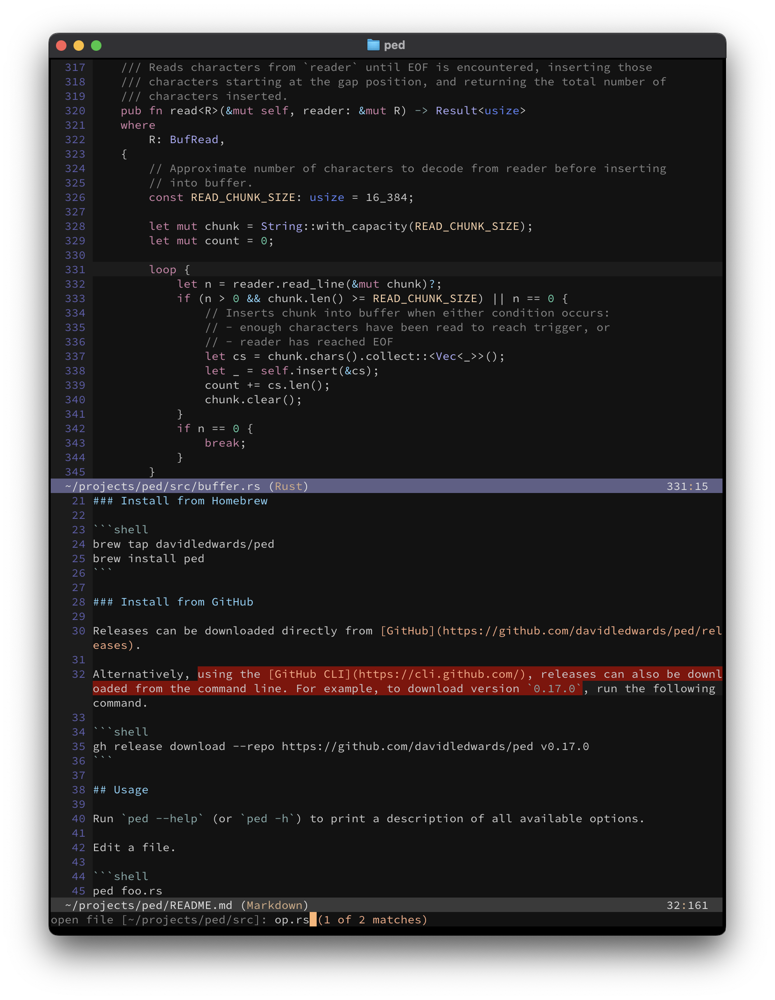

# ped

The *ped*estrian text editor.



## Background

The genesis of this project stemmed from a desire to learn the [Rust](https://www.rust-lang.org/) programming language while also building something useful and nontrivial.

During my university years studying computer science, I spent evenings and weekends developing a text editor for MS-DOS in Turbo Pascal 3.0. Unfortunately, the source code has been lost forever, but rest assured that reviewing that code today would likely be a dreadful experience.

This is a hobbyist project with the goal of building a fully functional terminal-based editor supporting multiple buffers and windows, regular expression search, syntax highlighting, and perhaps other features yet to be decided. I plan to develop most everything from scratch as opposed to using prebuilt libraries. The desire is to learn, not to go fast.

## Install

### Install from Homebrew

```shell
brew tap davidledwards/ped
brew install ped
```

### Install from GitHub

Releases can be downloaded directly from [GitHub](https://github.com/davidledwards/ped/releases).

Alternatively, using the [GitHub CLI](https://cli.github.com/), releases can also be downloaded from the command line. For example, to download version `0.1.0`, run the following command.

```shell
gh release download --repo https://github.com/davidledwards/ped v0.1.0
```

## Usage

Run `ped --help` to print a description of all available options.

`ped` will try to locate and read a configuration file at the following paths in order of precedence.

- `$HOME/.pedrc`
- `$HOME/.config/ped/pedrc`

Alternatively, a configuration file can be specified on the command line using the `--config` option.

See [.pedrc] for a detailed explanation of configuration settings. In the absence of a configuration file, `ped` will rely on default values.

## Design

## Release

Instructions for building and releasing can be found [here](RELEASE.md).

## Contributing

Please refer to the [contribution guidelines](CONTRIBUTING.md) when reporting bugs and suggesting improvements.

## License

Copyright 2024 David Edwards

Licensed under the Apache License, Version 2.0 (the "License"); you may not use this file except in compliance with the License. You may obtain a copy of the License at

<http://www.apache.org/licenses/LICENSE-2.0>

Unless required by applicable law or agreed to in writing, software distributed under the License is distributed on an "AS IS" BASIS, WITHOUT WARRANTIES OR CONDITIONS OF ANY KIND, either express or implied. See the License for the specific language governing permissions and limitations under the License.
